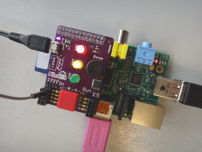

# Getting started with Pibrella 

## Introduction
Do you have an add on board for your Raspberry Pi called a [Pibrella?](http://pibrella.com/) Then what are you waiting for, let's get programming it!

This project will teach you how to use Scratch GPIO and the Python Pibrella library in order to make use of your Pibrella.

## Requirements

As well as a Raspberry Pi with an SD card loaded with Raspbian, you'll also need:

## Hardware

- A Pibrella

## Software

- Pibrella Python Library

See more information on checking you have these packages installed, and how to install them, on the software installation page.

## Worksheet

You will need to follow the steps in the worksheet below.

- worksheet

## Licence

Unless otherwise specified, everything in this repository is covered by the following licence:

Creative Commons Attribution 4.0 International Licence

Getting Started with Pibrella by the Raspberry Pi Foundation is licensed under a Creative Commons Attribution 4.0 International Licence.

Based on a work at https://github.com/raspberrypilearning/pibrella-intro
